# Lab1Web

## Praktikum 1 - HTML Dasar

### Identitas Mahasiswa

Nama: Nama Mahasiswa

Program Studi: Teknik Informatika

Mata Kuliah: Pemrograman Web

---

## Tujuan Praktikum

Praktikum ini bertujuan untuk memahami struktur dasar HTML, memahami tag-tag dasar HTML, dan membuat dokumen HTML.

## 1. Struktur Dasar HTML

Pada tahap pertama dibuat file `index.html` dengan struktur dasar HTML yang terdiri dari `<!DOCTYPE html>`, `<html>`, `<head>`, dan `<body>`.

Screenshot:

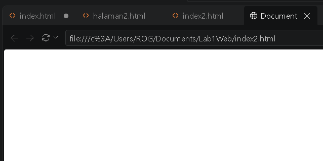

## 2. Membuat Paragraf

Pada tahap ini dibuat beberapa paragraf menggunakan tag `
`.

Screenshot:

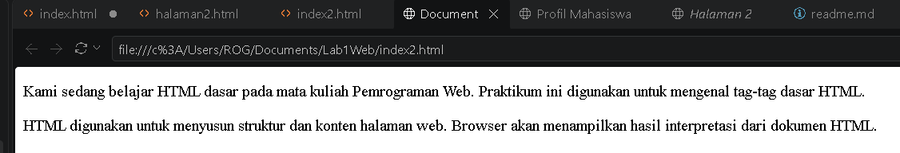

## 3. Menambahkan Judul

Heading ditambahkan menggunakan tag `<h1>` dan `<h2>` untuk membuat judul utama dan subjudul.

Screenshot:

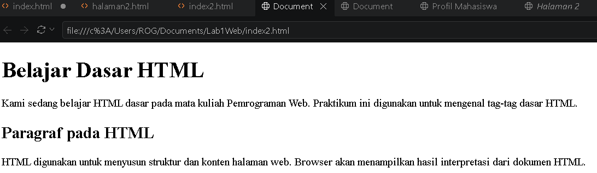

## 4. Memformat Teks

Pada tahap ini digunakan beberapa tag pemformatan teks seperti `<b>`, `<i>`, `<strong>`, `<mark>`, `<small>`, `<del>`, `<ins>`, ``, dan ``.

Screenshot:

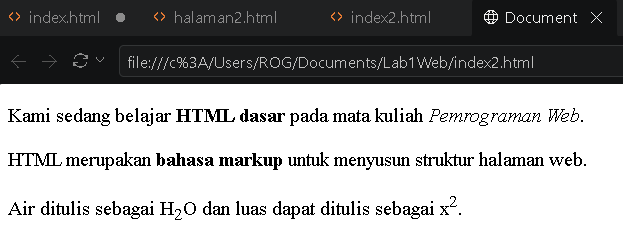

## 5. Menambahkan Gambar

Gambar ditambahkan menggunakan tag `` dengan atribut `src`, `width`, `alt`, dan `title`.

Screenshot:

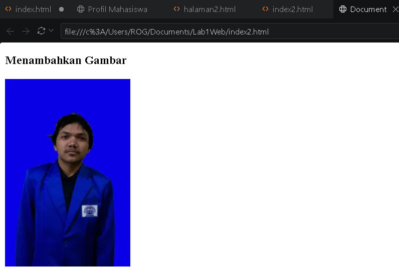

## 6. Mengubah Ukuran Gambar

Untuk mengatur ukuran gambar dapat digunakan atribut `width` dan `height`.

Screenshot:

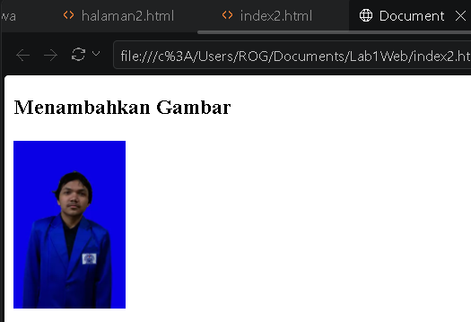

## 7. Menambahkan Hyperlink

Dibuat hyperlink internal menuju `halaman2.html` dan hyperlink eksternal menuju website lain.

Screenshot:

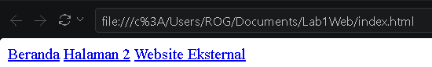

## 8. Membuat List

Dibuat unordered list menggunakan `<ul>` dan ordered list menggunakan `<ol>`.

Screenshot:

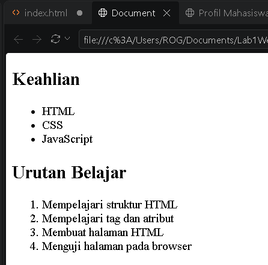

## 9. Menambahkan Komentar

Komentar HTML ditambahkan menggunakan sintaks `<!-- komentar -->`.

Screenshot:

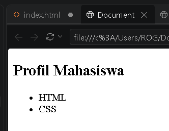

## 10. Menggabungkan Semua Elemen

Semua elemen HTML yang telah dipelajari digabungkan menjadi halaman Profil Mahasiswa.

Screenshot:

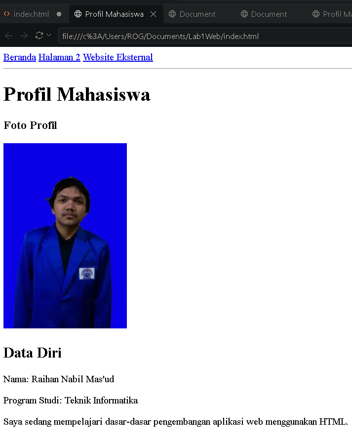
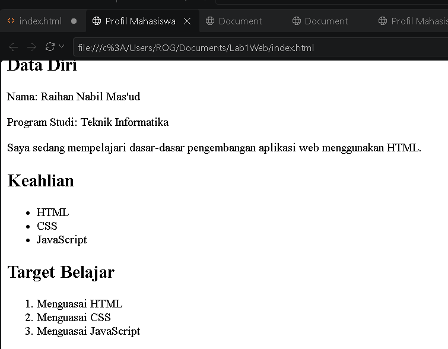

## Kesimpulan

Praktikum HTML Dasar memberikan pemahaman mengenai struktur dokumen HTML, tag, atribut, heading, paragraf, pemformatan teks, gambar, hyperlink, list, dan komentar. Melalui praktikum ini, halaman web sederhana dapat dibuat dan ditampilkan menggunakan browser.
